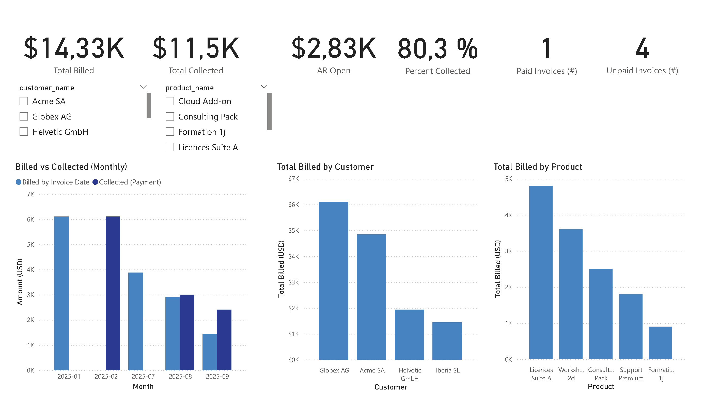
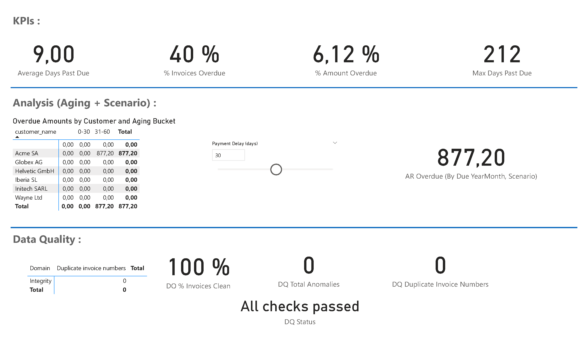

# Finance-ERP-SQL-PowerBI

# ERP Demo – SQL + Power BI Project

This project is a **mini ERP system** built in PostgreSQL with a connected **Power BI dashboard**.  
It demonstrates end-to-end skills: **SQL modeling, data generation, analytical queries, and BI reporting**.

---

## 1. Database Schema

The schema includes customers, products, employees, invoices, invoice lines, payments, and payment allocations.  
Invoice status is managed via a PostgreSQL enum.

File: [`db/01_schema.sql`](db/01_schema.sql)

Main objects:
- `customers`, `products`, `employees`
- `invoices`, `invoice_lines`
- `payments`, `payment_allocations`
- Enum `invoice_status`
- Indexes for performance

---

## 2. Seed Data

Initial dataset for customers, products, employees, invoices, lines, and payments.  
Used to quickly test the schema and build the first dashboards.

File: [`db/02_seed.sql`](db/02_seed.sql)

---

## 3. Views

Analytical views for reporting in Power BI.

File: [`db/03_views.sql`](db/03_views.sql)

- **`v_invoice_totals`** → totals excl. tax, tax, incl. tax per invoice  
- **`v_invoice_open_balance`** → billed, collected, open balance per invoice  

---

## 4. Analytical Queries

Example SQL queries used directly for KPIs and checks.

File: [`db/04_queries.sql`](db/04_queries.sql)

- Paid vs unpaid invoices by month  
- Revenue per customer (billed / collected / balance)  

---

## 5. Synthetic Data Generation

PL/pgSQL script to generate synthetic invoices and lines month by month.  
Allows extension of the dataset to simulate real operations (e.g. 12 months of activity).

File: [`db/05_generation.sql`](db/05_generation.sql)

---

## 6. Power BI Report

File: [ERP Demo - SQL Project.pbix](powerbi/ERP%20Demo%20-%20SQL%20Project.pbix)

PDF Export: [`docs/SQL Project.pdf`](docs/SQL%20Project.pdf)

### Page 1 – Financial Overview
- KPIs: Total Billed, Total Collected, Open Balance, % Collected  
- Paid vs Unpaid invoices (monthly trend)  
- Revenue by Customer  
- Revenue by Product  



### Page 2 – Risk & Data Quality
- Risk KPIs: Avg Days Past Due, % Invoices Overdue, % Amount Overdue, Max Days Past Due  
- Aging Report: overdue amounts by customer and aging bucket  
- Scenario (What-If) block with Payment Delay parameter  
- Data Quality checks: % Clean Invoices, Duplicate numbers, anomalies 

  

---

## 7. How to Run

1. Clone the repo:
   ```bash
   git clone https://github.com/<your-username>/erp-sql-powerbi.git
   cd erp-sql-powerbi
